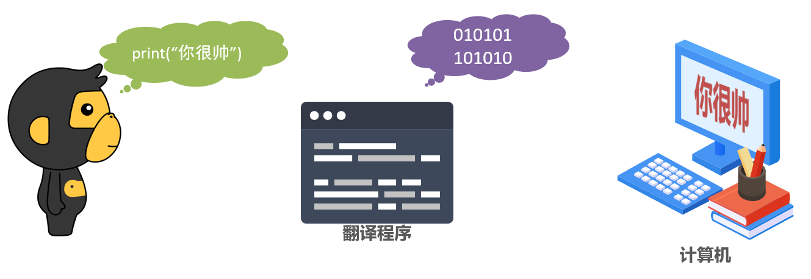
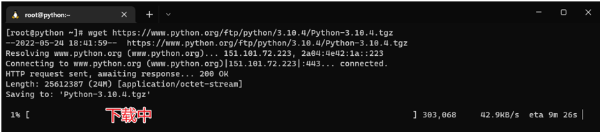
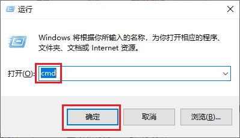
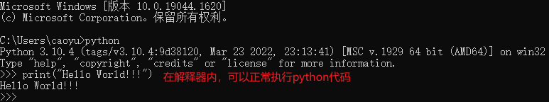
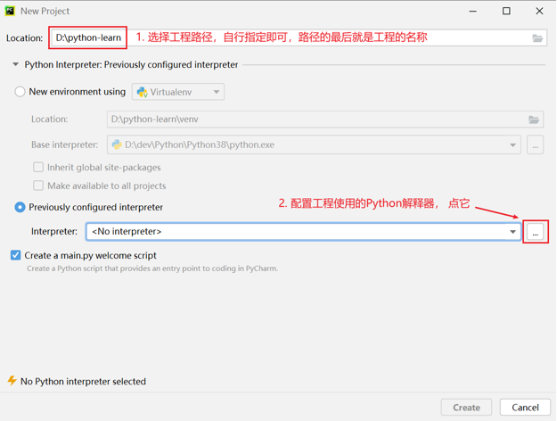
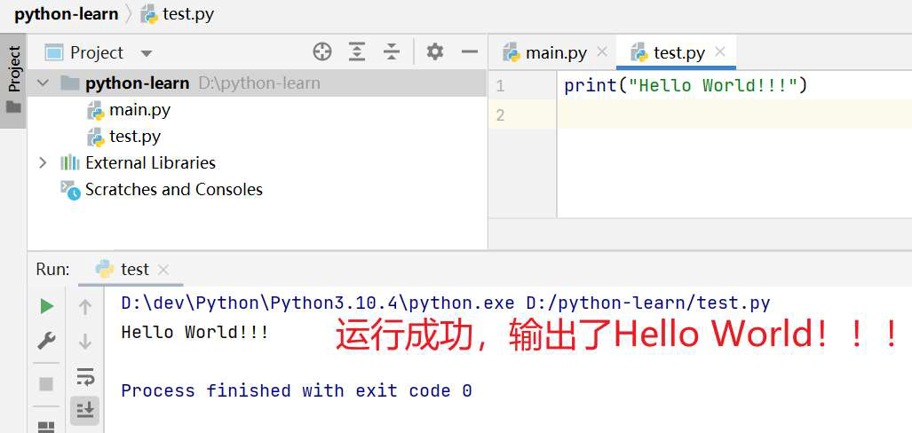
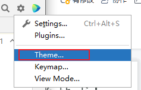

# 一、初识 Python

**Python 的起源**

1989 年，为了打发圣诞节假期，Gudio van Rossum 吉多范罗苏姆（龟叔）决心开发一个新的解释程序（Python 雏形）

1991 年，第一个 Python 解释器诞生

Python 这个名字，来自龟叔所挚爱的电视剧 Monty Python\'s Flying Circus

**为什么选择 Python**

1、优雅

* 简单、易学、开发效率高

2、适用面广泛

| 人群/岗位           | 用 Python 做什么                               |
| ------------------- | ---------------------------------------------- |
| IT 从业者           | 自动化脚本（运维开发、测试开发等）             |
| 普通白领            | 自动化办公                                     |
| 后端开发            | WEB 应用程序                                   |
| 科学家              | 基于 Python 完成数据计算（生物、化学、物理）   |
| 人工智能 / 机器学习 | 基于 Python 开发 AI 程序                       |
| 大数据开发          | 基于 Python 完成大数据任务开发（Spark、Flink） |
| 学生                | 计算机二级考试、小学六年级 Python 课程         |


# 二、什么是编程语言

首先，不管 Python，我们先搞明白，什么是编程语言

语言：进行沟通交流的表达方式

但计算机只认识二进制 0 和 1

人类翻译官无法沟通，那要怎么做才能和计算机交流呢？

这时就需要借助编程语言

以 Python 为例：



为什么不直接把中文翻译成二进制呢？

因为自然语言远比编程语言复杂，同样的中文意思可以有好几种中文表达，如在屏幕上显示你好帅、把你好帅显示在屏幕上、快夸我帅是同一个意思。

编程语言不一样，编程语言语法"死板"，"翻译官"更容易翻译

> 总结：
>
> 1. 什么是编程语言？
>    * 人类和计算机交流的一种专有领域语言
> 2. 编程语言的工作原理？
>    * 想法转换为编程语言代码
>    * 通过翻译官（解释器）翻译成二进制提交计算机执行

# 三、Python 安装

## 1、Windows

### 下载

想要使用 Python 语言编写程序，我们必须下载 Python 安装包并配置 Python 环境。

Python 目前最新版本是 3.10.4，发布于 2022 年 3 月 24 日


下载最新版Python：[https://www.python.org/downloads](http://www.python.org/downloads)


点击即可下载

### 安装

双击打开下载的安装包


点击 Next


### 验证

点击左下角 windows 键，输入 cmd，打开 "命令提示符" 程序


在命令提示符内输入 `python` 并回车


## 2、MacOS

基于 MacOS 12.4

### 下载

下载最新版 Python：[https://www.python.org/downloads](http://www.python.org/downloads)


找到 macOS 系统按钮，并点击

点击后在弹出的网页内点击最新的 python3.10.4 的按钮


拖动网页到最下方，如下图


下载完成后，应该可以看到如下文件：


### 安装

双击打开下载好的 python-3.10.4-macos11.pkg 文件，开始安装


点击安装按钮


输入电脑锁屏密码后点击安装软件


### 验证

找到 mac 中的 "终端" 程序并打开：


直接在终端中输入：`python3`

如图，最新版 3.10.4 已经安装成功。


如果想要使用 python 命令，而非 python3 命令执行 python，那么可以设置环境变量来解决，在终端中执行如下代码：

```bash
echo 'alias python=python3' >> .bash_profile
```

退出且重新打开终端，然后执行：`python`


至此便完成了在 Mac 系统中安装并配置 Python

## 3、Linux

本次演示的操作系统是基于 CentOS 7 版本的 Linux 操作系统

> 提示：在 Linux 上安装 Python 需要如下前置技能：
>
> 有过 Linux 系统的使用经验，熟悉 Linux 操作系统的常见命令，如：yum、cd、wget、vi 编辑器、软链接等

### 下载

在 Linux 上安装 Python 需要先安装前置依赖程序。因为 Python 如果部署在 Linux 操作系统上，是需要通过源码去编译安装的，编译的过程会依赖一些第三方的软件，这些软件需要提前安装好，可以通过 yum 程序安装这些软件

登录到 Linux 中，使用 yum 程序进行依赖程序安装，执行如下命令：

```bash
yum install wget zlib-devel bzip2-devel openssl-devel ncurses-devel sqlite-devel readline-devel tk-devel gcc make zlib zlib-devel libffi-devel -y
```

下载最新版 Python：[https://www.python.org/downloads](http://www.python.org/downloads)


找到 Linux 系统按钮，并点击

点击后在弹出的网页内点击最新的 python3.10.4 的按钮


拖动网页到最下方，如下图


找到 Gzipped source tarball 按钮，点击右键，选择复制链接


进入到 Linux 系统内，使用 wget 命令，粘贴复制的下载链接，进行下载

```bash
cd ~

wget https://www.python.org/ftp/python/3.10.4/Python-3.10.4.tgz
```



下载完成后，即可看到已下载好的安装包文件：


### 安装

解压安装包，执行：`tar -xvf Python-3.10.4.tgz`


切换目录到解压后的 Python 安装文件夹：

```bash
# 切换目录
cd Python-3.10.4
```

1.  配置

大约耗时 30 秒

```bash
./configure --prefix=/usr/local/python3.10.4
```

2.  编译

大约耗时 10 分钟，请耐心等待

```bash
make && make install
```

编译完成后，可以配置软链接，方便快速使用 python

```bash
# 删除系统自带的老版本(python2)的软链接
rm -f /usr/bin/python

# 创建软链接
ln -s /usr/local/python3.10.4/bin/python3.10 /usr/bin/python
```

创建软链接后，会破坏 yum 程序的正常使用（只能使用系统自带的 python2）

修改如下 2 个文件：

* /usr/bin/yum
* /usr/libexec/urlgrabber-ext-down

使用 vi 编辑器，将这 2 个文件的第一行，从 `\#!/usr/bin/python` 修改为：`\#!/usr/bin/python2`

### 验证

在 Linux 系统命令行窗口内，直接执行：`python` 并回车：


如图，看到 Python 3.10.4 字样，即表明安装成功。

# 四、第一个 Python 程序

## 1、开发步骤

向世界说你好，应该是全世界，所有程序员入门编程语言时，都会选择的第一个程序。

让我们也延续这一份来自程序员之间的浪漫，学习如何使用Python，向世界说你好。

我们的Python代码非常简单，如下：

`print("Hello World")`

含义：向屏幕上输出（显示）Hello World

> **注意**：输入的双引号和括号，请使用**英文符号**哦

步骤：

1. 打开 CMD（命令提示符）程序，输入 python 并回车

2. 看到三个向右的箭头后，表明可以输入代码

3. 然后在里面输入代码回车即可立即执行


## 2、常见问题

1、找不到 "命令提示符" 程序在哪里使用

解决办法：使用快捷键：win + r


打开运行框，输入 cmd 后回车即可打开命令提示符程序



2、命令提示符内，输入 python 出现：

\'python\' 不是内部或外部命令，也不是可运行的程序或批处理文件。


问题解答：安装 Python 的时候，没有勾选：add python 3.10 to PATH 的选项


卸载 Python，重新安装 Python，勾选这个选项。然后重新打开命令提示符程序即可

或者手动把 Python 安装路径添加到环境变量的 path 中

3、命令提示符内，出现 “无法初始化设备 PRN”


问题解答：这是因为没有进入到 Python 解释器环境内执行代码。

应该在命令提示符内先输入 python，当屏幕上出现 >>> 的标记时，输入代码执行才可以


4、执行时出现：SyntaxError: invalid character ' “ ' (U+201C)


问题解答：这是因为代码中的符号是中文符号。

请检查代码中的双引号和小括号，这两个符号应该是英文符号

# 五、Python 解释器

首先，一个基本原理是：**计算机只认识二进制，即 0 和 1**

那我们之前写的程序 `print("Hello World")`，计算机为什么会认识？

其实很简单，计算机是不会认识 Python 代码的。但是 Python 有解释器程序，如下图：


安装 Python 环境，本质上就是在电脑中安装 Python 解释器程序

代码，随时可以写，但能不能运行，就要看电脑里面有没有解释器程序了。

Python 解释器，是一个计算机程序，用来翻译 Python 代码，并提交给计算机执行。

所以，它的功能很简单，就两点：

1.  翻译代码

2.  提交给计算机运行

解释器我明白了，可是解释器在哪呢？

> 解释器存放在：<Python 安装目录>/**python.exe**


我们在 CMD（命令提示符）程序内执行的 python，就是上图的 python.exe 程序


不使用解释器，计算机不认识 Python 代码


使用 Python 解释器程序，就能执行 Python 代码了



思考一下：在 python 解释器程序内，我们发现写完一行代码并回车后，会直接运行它。

问题来了：我们能否写好多行代码，一次性的运行呢？

答案是：可以的

我们可以将代码写入一个以 ".py" 结尾的文件中，使用 python 命令去运行它。

比如在 Windows 系统的 D 盘，我们新建一个名为 test.py 的文件，并通过记事本程序打开它，输入如下内容：

```python
print("学Python，来黑马！！！")
print("月薪过万。")
```

在 "命令提示符" 程序内，使用 python 命令运行它，如图：


总结

1.  计算机只认识什么？
    * 0 和 1

2.  Python 解释器的作用是？
    * 将 Python 代码翻译成计算机认识的 0 和 1 并提交计算机执行
    * 在解释器环境内可以一行行的执行我们输入的代码
    * 也可以使用解释器程序，去执行 ".py" 代码文件

3.  ".py" 文件是什么？
    * Python 语言的代码文件，里面记录了 Python 的代码

4.  Python 解释器程序的位置
    * <Python 安装目录>/python.exe

# 六、Python 开发工具

Python 程序的开发有许多种方式，一般我们常见的有：

-   Python 解释器环境内，执行单行代码

-   使用 Python 解释器程序，执行 Python 代码文件

-   使用第三方 IDE（集成开发工具），如 PyCharm 软件，开发 Python 程序

最常用的就是使用 PyCharm 软件进行开发，PyCharm 集成开发工具（IDE），是当下全球 Python 开发者，使用最频繁的工具软件。绝大多数的 Python 程序，都是在 PyCharm 工具内完成的开发。

## 1、下载

首先，我们来下载并安装它：

打开网站：[https://www.jetbrains.com/pycharm/download/#section=windows](http://www.jetbrains.com/pycharm/download/#section%3Dwindows)


## 2、安装

步骤 1：


步骤 2：


步骤 3：


步骤 4：


步骤 5：


步骤 6：安装完成。


## 3、使用

找到安装好的 Python，打开：


即可看到软件正常可用：


创建一个工程，我们来尝试写一写代码


指定工程路径以及选择 Python 解释器



配置 Python 解释器：


确认工程路径和解释器


工程创建完成：


创建一个 Python 代码文件，名称为 test.py


填写如下内容


在空白处右键，然后选择运行：


运行成功啦



> 总结
>
> 1.  Python 最常见的开发环境是：
>     * PyCharm 软件，这是一个专用于 Python 的开发工具
> 2.  PyCharm 以"工程"为单元，供我们使用。想要写代码需要先创建一个工程
>

## 4、PyCharm 的基础配置

### 修改主题

默认是黑色主题，我们可以在 PyCharm 的右上角，点击"齿轮"


然后点击 "theme"，选择主题：



选择想要的主题即可：


### 修改默认字体和大小

打开设置：


### 通过快捷键快速设置字体大小

打开设置：


快速增大字体大小：


添加鼠标快捷键：


按 ctrl + 鼠标滚轮上


快速减小字体大小：


### 常用插件

打开插件功能：


搜索插件 “chinese” 并安装


其它插件，如翻译软件：


### 常用快捷键

-   `ctrl + alt + s`：打开软件设置

-   `ctrl + d`：复制当前行代码

-   `shift + alt + 上 \ 下`：将当前行代码上移或下移

-   `crtl + shift + f10`：运行当前代码文件

-   `shift + f6`：重命名文件

-   `ctrl + a`：全选

-   `ctrl + c \ v \ x`：复制、粘贴、剪切

-   `ctrl + f`：搜索

