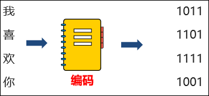
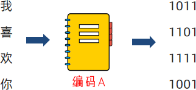
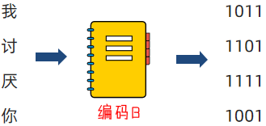
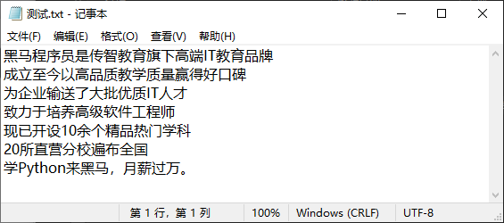
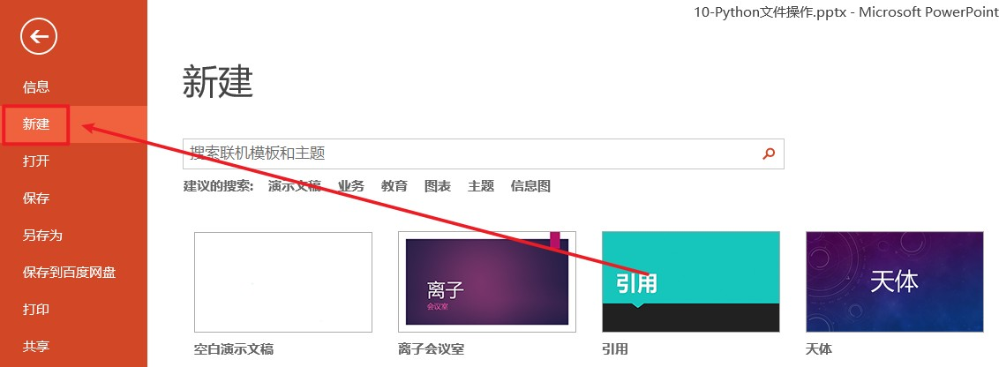

# 一、文件的编码

## 文件编码概述

思考：计算机只能识别 0 和 1 ，那么我们丰富的文本文件是如何被计算机识别，并存储在硬盘中呢？

答案：使用编码技术（密码本）将内容翻译成 0 和 1 存入。

编码技术即翻译的规则，记录了如何将内容翻译成二进制，以及如何将二进制翻译回可识别内容。



计算机中有许多可用编码：

-   UTF-8

-   GBK

-   Big5

-   等

不同的编码，将内容翻译成二进制也是不同的。

编码有许多，所以要使用正确的编码，才能对文件进行正确的读写操作。

{width="3.3534820647419075in" height="1.5520833333333333in"}


{width="3.426388888888889in" height="1.625in"}

如上，如果你给喜欢的女孩发送文件，使用编码 A 进行编码（内容转二进制）。女孩使用编码 B
打开文件进行解码（二进制反转回内容），自求多福吧。

## 查看文件编码

我们可以使用 Windows 系统自带的记事本，打开文件后，即可看出文件的编码是什么：

{width="5.884722222222222in" height="2.6041666666666665in"}

> UTF-8 是目前全球通用的编码格式
>
> 除非有特殊需求，否则，一律以 UTF-8 格式进行文件编码即可。

## 总结

1.  什么是编码？

编码就是一种规则集合，记录了内容和二进制间进行相互转换的逻辑。

编码有许多种，我们最常用的是 UTF-8 编码

2. 为什么需要使用编码

计算机只认识 0 和 1 ，所以需要将内容翻译成 0 和 1 才能保存在计算机中。

同时也需要编码， 将计算机保存的 0 和 1 ，反向翻译回可以识别的内容。

# 二、文件的读取

## 文件操作概述

内存中存放的数据在计算机关机后就会消失。要长久保存数据，就要使用硬盘、光盘、U 盘等设备。为了便于数据的管理和检索，引入了"文件"的概念。

一篇文章、一段视频、一个可执行程序，都可以被保存为一个文件，并赋予一个文件名。操作系统以文件为单位管理磁盘中的数据。一般来说，文件可分为文本文件、视频文件、音频文件、图像文件、可执行文件等多种类别。


文件操作包含哪些内容呢？

在日常生活中，文件操作主要包括打开、关闭、读、写等操作。



文件的操作步骤：

想想我们平常对文件的基本操作，大概可以分为三个步骤（简称文件操作三步走）：

① 打开文件

② 读写文件

③ 关闭文件

注意：可以只打开和关闭文件，不进行任何读写

## open() 打开函数

在Python ，使用 open 函数，可以打开一个已经存在的文件，或者创建一个新文件，语法如下：

`open(name,mode,encoding)`

* name：要打开的目标文件名的字符串（可以包含文件所在的具体路径）

调用open函数时，若使用相对路径，注意，相对路径是相对于当前工作目录的路径，而不是相对于python文件所在的目录的路径。当前工作目录指的是Python脚本（或者Python解释器）执行操作时所处的目录。所有相对路径都是相对于当前工作目录计算的。

在Python中，可以通过调用`os.getcwd()`函数来获取当前工作目录的绝对路径。也可以使用`os.chdir(path)`函数来更改当前工作目录到指定的路径。

```python
"""
假设当前目录是/Users/abc/Desktop， 并且有一个文件test.py，
它位于/Users/abc/Desktop/project/src目录下的，
则在test.py中执行以下操作来检查当前工作目录：
"""

import os

# 获取当前工作目录
print(os.getcwd()) 
# 输出：/Users/abc/Desktop

# 更改当前工作目录到src目录下
os.chdir('project/src')
print(os.getcwd())
# 输出：/Users/abc/Desktop/project/src
```

* mode：设置打开文件的模式 ( 访问模式 ) ：只读、写入、追加等。
* encoding：编码格式（推荐使用 UTF-8 ）

示例代码：

```python
f = open('python.txt', 'r', encoding="UTF-8")
# encoding 的顺序不是第三位，所以不能用位置参数，用关键字参数直接指定
```

注意：此时的 `f` 是 `open` 函数的文件对象，对象是 Python 中一种特殊的数据类型，拥有属性和方法，可以使用对象 . 属性或对象 . 方法对其进行访问。

### mode 常用的三种基础访问模式

* r：以只读方式打开文件。文件的指针将会放在文件的开头。这是默认模式。
* w：打开一个文件只用于写入。如果该文件已存在则打开文件，并从开头开始编辑，原有内容会被删除。如果该文件不存在，创建新文件。
* a：打开一个文件用于追加。如果该文件已存在，新的内容将会被写入到已有内容之后。如果该文件不存在，创建新文件进行写入。

## 读操作相关方法

1. read() 方法：

`文件对象.read(num)`

num 表示要从文件中读取的数据的长度（单位是字节），如果没有传入 num ，那么就表示读取文件中所有的数据。 

2. readlines() 方法： 

readlines 可以按照行的方式把整个文件中的内容进行一次性读取，并且返回的是一个列表，其中每一行的数据为一个元素。

3. readline() 方法：一次读取一行内容
4. for 循环读取文件行

每一个line临时变量，就记录了文件的一行数据

5. close() 关闭文件对象

最后通过 close ，关闭文件对象，也就是关闭对文件的占用 。如果不调用 close, 同时程序没有停止运行，那么这个文件将一直被 Python 程序占用。

6. with open 语法

通过在 with open 的语句块中对文件进行操作 ，可以在操作完成后自动关闭 close 文件，避免遗忘掉 close 方法

### 操作汇总

1. 文件对象 = open(file, mode, encoding) ：打开文件获得文件对象
2. 文件对象.read(num)：读取指定长度字节，不指定num读取文件全部
3. 文件对象 .readline() ：读取一行
4. 文件对象.readlines()：读取全部行，得到列表
5. for line in 文件对象 ：for 循环文件行，一次循环得到一行数据
6. 文件对象 .close() ：关闭文件对象
7. with open() as f ：通过 with open 语法打开文件，可以自动关闭      |

```python
# 打开文件
f=open("E:/测试.txt","r",encoding="UTF-8")
print(type(f))

# 读取文件-read
# 连续调用两次read方法，第二次会从第一次读取的内容末尾接着读取
print(f"读取10个字节的结果是：{f.read(10)}")
print(f"读取全部内容的结果是：{f.read()}")

# 读取文件-readlines
# 读取文件的全部行，封装到列表中
lines=f.readlines()
print(f"lines对象的类型：{type(lines)}")
print(f"lines对象的内容：{lines}")

# 读取文件-readline
line1=f.readline()
line2=f.readline()
print(line1)
print(line2)

# for循环读取文件行
for line in f:
    print(f"每一行数据是：{line}")

# 文件的关闭
f.close()

# with open 语法操作文件
with open("E:/测试.txt","r",encoding="UTF-8") as f:
    for line in f:
        print(line)
```

课后练习：单词计数

通过 Windows 的文本编辑器软件，将如下内容，复制并保存到： word.txt，文件可以存储在任意位置

```
itheima itcast python
itheima python itcast
beijing shanghai itheima
shenzhen guangzhou itheima
wuhan hangzhou itheima
zhengzhou bigdata itheima
```

通过文件读取操作，读取此文件，统计 itheima 单词出现的次数

```python
count=0
with open("08-Python文件操作/src/word.txt","r",encoding="UTF-8") as f:
    # 方法1
    #content=f.read()
    #count=content.count("itheima")
    
    # 方法2
    for line in f:
        line=line.strip()#去除开头和结尾的空格以及换行符
        # 注意若不strip列表最后一个字符串会带有"\n"
        list=line.split(' ')
        for l in list:
            if l=="itheima":
                count=count+1
print(count)
```

# 三、文件的写入

## 写操作快速入门

案例演示：

```python
# 1. 打开文件
f = open('python.txt', 'w')
# 2. 文件写入
f.write('hello world')
# 3. 内容刷新
f.flush()
```

注意：

* 直接调用write，内容并未真正写入文件，而是会积攒在程序的内存中，称之为缓冲区

-   当调用 flush 的时候，内容会真正写入文件。另外close方法内置了flush功能的

-   这样做是避免频繁的操作硬盘，导致效率下降（攒一堆，一次性写磁盘）

## 写操作注意

-   文件如果不存在，使用" w" 模式，会创建新文件

-   文件如果存在，使用" w" 模式，会将原有内容清空

```python
# 打开一个不存在的文件
f=open("08-Python文件操作/src/test.txt","w",encoding="utf-8")
# write写入
f.write("hello world")
# flush刷新
f.flush()
# close关闭
f.close()

# 打开一个存在的文件
f=open("08-Python文件操作/src/test.txt","w",encoding="utf-8")
# write写入，flush刷新
f.write("hello python")
f.flush()
# close关闭
f.close()
```

# 四、文件的追加

1.  追加写入文件使用 open 函数的" a" 模式进行写入

2.  追加写入的方法有（和 w 模式一致）：
    * write()，写入内容
    * flush() ，刷新内容到硬盘中

3.  注意事项：

    -   a 模式，文件不存在，会创建新文件

    -   a 模式，文件存在，会在原有内容后面继续写入

    -   可以使用" \\n" 来写出换行符

案例演示：

```python
# 打开不存在的文件
f=open("08-Python文件操作/src/test.txt","a",encoding="utf-8")
f.write("hello world")
f.flush()
f.close()

# 打开存在的文件
f=open("08-Python文件操作/src/test.txt","a",encoding="utf-8")
f.write("\nhello python")
f.close()
```

# 五、文件操作综合案例

需求：有一份账单文件 bill.txt ，记录了消费收入的具体记录，内容如下。完成文件备份

```
name,date,money,type,remarks
周杰轮,2022-01-01,100000,消费,正式
周杰轮,2022-01-02,300000,收入,正式
周杰轮,2022-01-03,100000,消费,测试
林俊节,2022-01-01,300000,收入,正式
林俊节,2022-01-02,100000,消费,测试
林俊节,2022-01-03,100000,消费,正式
林俊节,2022-01-04,100000,消费,测试
林俊节,2022-01-05,500000,收入,正式
张学油,2022-01-01,100000,消费,正式
张学油,2022-01-02,500000,收入,正式
张学油,2022-01-03,900000,收入,测试
王力鸿,2022-01-01,500000,消费,正式
王力鸿,2022-01-02,300000,消费,测试
王力鸿,2022-01-03,950000,收入,正式
刘德滑,2022-01-01,300000,消费,测试
刘德滑,2022-01-02,100000,消费,正式
刘德滑,2022-01-03,300000,消费,正式
```

我们现在要做的就是：

-   读取文件

-   将文件写出到 bill.txt.bak 文件作为备份

-   同时，将文件内标记为测试的数据行丢弃

实现思路：

-   open 和 r 模式打开一个文件对象，并读取文件

-   open 和 w 模式打开另一个文件对象，用于文件写出

-   for 循环内容，判断是否是测试，不是测试就 write 写出，是测试就 continue 跳过
    
-   将 2 个文件对象均 close()

```python
# 打开一个文件对象，并读取文件
fr=open("08-Python文件操作/src/bill.txt","r",encoding="utf-8")

# 打开另一个文件对象，用于文件写出
fw=open("08-Python文件操作/src/bill.txt.bak","w",encoding="utf-8")

# for 循环内容，判断是否是测试，不是测试就 write 写出，是测试就 continue 跳过
for line in fr:
    line=line.strip()
    if line.split(",")[-1]=="测试":
        continue
    else:
        fw.write(line)
        # 由于前面对内容进行了strip的操作，所以要手动写出换行符
        fw.write("\n")

# 将2个文件对象均 close()
fr.close()
fw.close()
```

