# 一、了解异常

## 什么是异常

当检测到一个错误时， Python 解释器就无法继续执行了，反而出现了一些错误的提示，这就是所谓的"异常" ，也就是我们常说的 BUG。

{width="10.5in" height="4.6in"}


## bug 单词的诞生

早期计算机采用大量继电器工作，马克二型计算机就是这样的。

1945 年 9 月 9 日，下午三点，马克二型计算机无法正常工作了，技术人员试了很多办法，最后定位到第
70 号继电器出错。负责人哈珀观察这个出错的继电器，发现一只飞蛾躺在中间，已经被继电器打死。她小心地用摄子将蛾子夹出来，用透明胶布帖到"事件记录本"中，并注明"第一个发现虫子的实例"。自此之后，引发软件失效的缺陷，便被称为 Bug 。

{width="5.045833333333333in" height="2.1305544619422574in"}


## 异常演示

例如：以 \`r\` 方式打开一个不存在的文件。

`f = open('linux.txt', 'r')`

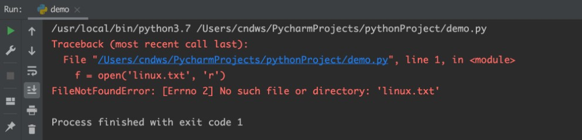

# 二、异常的捕获方法

### 为什么要捕获异常

世界上没有完美的程序，任何程序在运行的过程中，都有可能出现：异常，也就是出现 bug 导致程序无法完美运行下去。

我们要做的，不是力求程序完美运行。而是在力所能及的范围内，对可能出现的 bug，进行提前准备、提前处理。这种行为我们称之为：异常处理（捕获异常）

当我们的程序遇到了 BUG, 那么接下来有两种情况 :

① 整个程序因为一个 BUG 停止运行

② 对BUG 进行提醒, 整个程序继续运行

显然在之前的学习中 , 我们所有的程序遇到 BUG 就会出现①的这种情况 ，也就是整个程序直接奔溃 。

但是在真实工作中 , 我们肯定不能因为一个小的 BUG 就让整个程序全部奔溃 ，也就是我们希望的是达到② 的这种情况，那我们就需要使用到**捕获异常**。

> 捕获异常的作用在于：提前假设某处会出现异常，做好提前准备，当真的出现异常的时候，可以有后续手段。

### 捕获常规异常

基本语法：

```python
try:
	可能发生错误的代码
except:
	如果出现异常执行的代码
```

如尝试以 r 模式打开文件，如果文件不存在，则以 w 方式打开。

```python
# 基本捕获语法
try:
    f=open("abc.txt","r",encoding="utf-8")
except:
    print("出现异常了，因为文件不存在，改为w模式打开")
    f=open("09-异常模块与包/src/abc.txt","w",encoding="utf-8")
```

### 捕获指定异常

基本语法：

```python
try:
	print(name)
except NameError as e:
	print('name 变量名称未定义错误 ')
```

演示案例：

```python
# 捕获指定的异常
try:
    print(name)
    # 1/0
except NameError as e:
    print("出现了变量未定义异常")
    print(e)
```

注意：

1. 如果尝试执行的代码的异常类型和要捕获的异常类型不一致，则无法捕获异常。 
2. 一般 try 下方只放一行尝试执行的代码。

### 捕获多个异常

当捕获多个异常时，可以把要捕获的异常类型的名字，放到 except 后，并使用元组的方式进行书写。

```python
try:
    # 1/0
    print(name)
except(NameError,ZeroDivisionError) as e:
    print("出现了变量未定义或者除以0的异常")
```

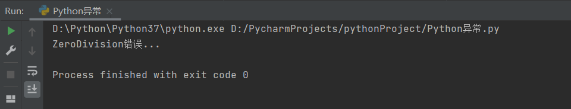{width="11.169255249343832in" height="2.1658333333333335in"}

### 捕获异常并输出描述信息

基本语法：

```python
try:
	print(num)
except (NameError, ZeroDivisionError) as e:
	print(e)
```

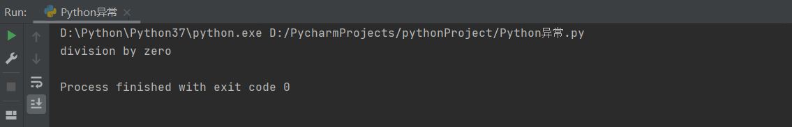{width="11.233080708661417in" height="1.8109372265966754in"}

### 捕获所有异常

基本语法：

```python
try:
	print(name)
except Exception as e:
	print(e)
```

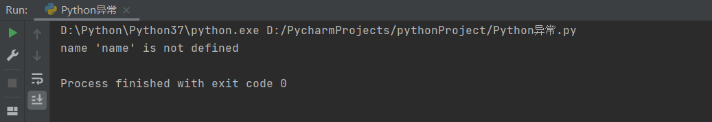{width="11.236084864391952in" height="1.9391666666666667in"}

### 异常 else

else 表示的是如果没有异常要执行的代码。

```python
try:
	print(1)
except Exception as e:
	print(e)
else:
	print('我是else,是没有异常的时候执行的代码 ')
```

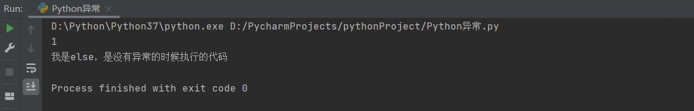{width="10.928331146106737in" height="1.7625in"}

### 异常的 finally

finally 表示的是无论是否异常都要执行的代码，例如关闭文件。

```python
try:
	f = open('test.txt', 'r')
except Exception as e:
	f = open('test.txt', 'w')
else:
	print(' 没有异常，真开心 ')
finally:
	f.close()
```

### 总结

1. 为什么要捕获异常？

在可能发生异常的地方，进行捕获。当异常出现的时候，提供解决方式，而不是任由其导致程序无法运行。

2. 捕获异常的语法？

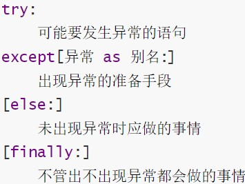{width="2.263888888888889in" height="1.7152766841644795in"}

3. 如何捕获所有异常？

异常的种类多种多样，如果想要不管什么类型的异常都能捕获到，那么可使用两种方式捕获全部的异常:

-   except:
-   except Exception:

# 三、异常的传递性

异常是具有传递性的

当函数 func01 中发生异常 , 并且没有捕获处理这个异常的时候 ，异常会传递到函数 func02, 当 func02 也没有捕获处理这个异常的时候 main 函数会捕获这个异常 , 这就是异常的传递性。

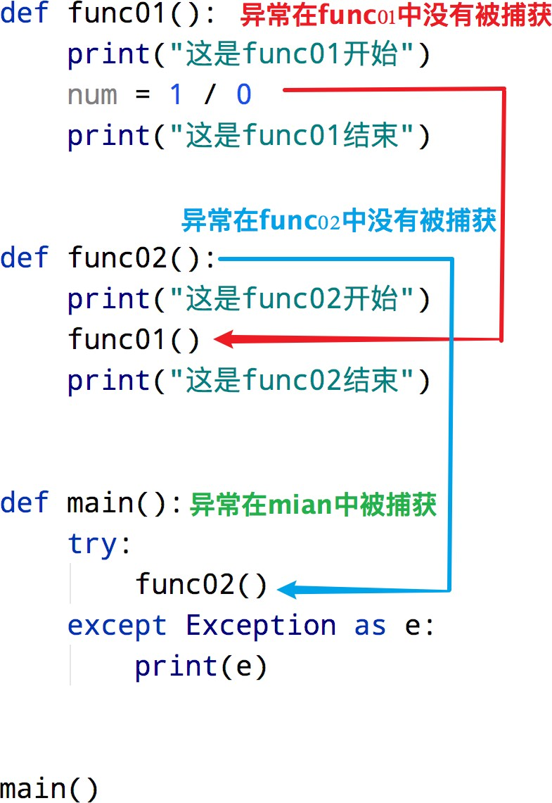

> 当所有函数都没有捕获异常的时候 , 程序就会报错

利用异常具有传递性的特点 ，当我们想要保证程序不会因为异常崩溃的时候 ，就可以在 main 函数中设置异常捕获 ，由于无论在整个程序哪里发生异常 ，最终都会传递到 main 函数中 , 这样就可以确保所有的异常都会被捕获

# 四、Python模块

## 模块的导入

### 什么是模块

Python 模块 (Module) ，是一个 Python 文件，以 .py 结尾。模块能定义函数，类和变量，模块里也能包含可执行的代码。

**模块的作用 :** python 中有很多各种不同的模块 ，每一个模块都可以帮助我们快速的实现一些功能，比如实现和时间相关的功能就可以使用 time 模块我们可以认为一个模块就是一个工具包，每一个工具包中都有各种不同的工具供我们使用进而实现各种不同的功能。

> 大白话：模块就是一个 Python 文件，里面有类、函数、变量等，我们可以拿过来用（导入模块去使用）
> 

### 模块的导入方式

模块在使用前需要先导入，导入的语法如下：

`[from 模块名] import [模块 | 类 | 变量 | 函数 | *] [as 别名]`

常用的组合形式如下：

-   import 模块名

-   from 模块名 import 类、变量、方法等

-   from 模块名 import \*

-   import 模块名 as 别名

-   from 模块名 import 功能名 as 别名

### import 模块名

基本语法：

```python
import 模块名
import 模块名 1 ，模块名 2

模块名.功能名()
```

示例代码：

```python
# 使用import导入time模块使用sleep功能（函数）
import time
print("hello")
time.sleep(5)
print("world")
```

### from 模块名 import 功能名

基本语法：

```python
from 模块名 import 功能名
功能名()
```

示例代码：

```python
# 使用from导入time的sleep功能（函数）
from time import sleep
print("hello")
sleep(5)
print("world")
```

### from 模块名 import \*

基本语法：

```python
from 模块名 import *
功能名()
```

示例代码：

```python
from time import *
print("hello")
sleep(5)
print("world")
```

### as 定义别名

基本语法：

```python
# 模块定义别名
import 模块名 as 别名

# 功能定义别名
from 模块名 import 功能 as 别名
```

示例代码：

```python
# 使用as给特定功能起别名
# import time as t
# print("hello")
# t.sleep(5)
# print("world")

from time import sleep as sl
print("hello")
sl(5)
print("world")
```

### 总结：

1. 什么是模块？

模块就是一个 Python 代码文件，内含类、函数、变量等，我们可以导入进行使用。

2. 如何导入模块

`[from 模块名] import [模块 | 类 | 变量 | 函数 | *] [as 别名]`

3. 注意事项：

-   from 可以省略，直接 import 即可

-   as 别名可以省略

-   通过" ." 来确定层级关系

-   模块的导入一般写在代码文件的开头位置

## 自定义模块

### 制作自定义模块

Python 中已经帮我们实现了很多的模块，不过有时候我们需要一些个性化的模块，这里就可以通过自定义模块实现，也就是自己制作一个模块。

案例：新建一个 Python 文件，命名为 my_module1.py，并定义 test 函数

```python
# my_module1.py

def test(a,b):
    print(a+b)
```

在另一个文件中导入my_moduole1模块：

```python
# 导入自定义模块进行使用
# import my_module1
# my_module1.test(1,2)
from my_module1 import test
test(1,2)
```

> **注意:**
> 
> 每个Python 文件都可以作为一个模块，模块的名字就是文件的名字。也就是说自定义模块名必须要符合标识符命名规则

### 测试模块

在实际开发中，当一个开发人员编写完一个模块后，为了让模块能够在项目中达到想要的效果，这个开发人员会自行在 py 文件中添加一些测试信息。例如，在 my_module1.py 文件中添加测试代码 test(1,1)

此时无论是当前文件，还是其他已经导入了该模块的文件，在运行的时候都会自动执行 test 函数的调用

**解决方案：**

```python
# my_module1.py

def test(a,b):
    print(a+b)

# 只在当前文件中调用该函数，其他导入的文件内不符合该条件，则不执行 test 函数调用
if __name__=='__main__':
    test(1,2)
```

### 注意事项

> 当导入多个模块的时候，且模块内有同名功能，当调用这个同名功能的时候，调用到的是后面导入的模块的功能

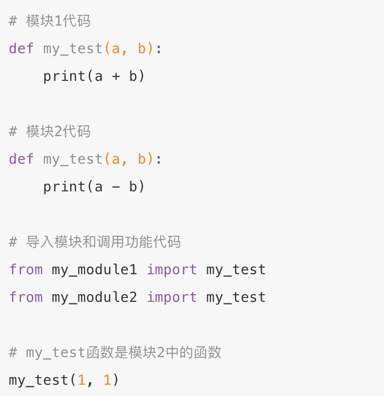

###  \__all__

如果一个模块文件中有 \` all \` 变量，当使用 \`from xxx import \*\` 导入时，只能导入这个列表中的元素

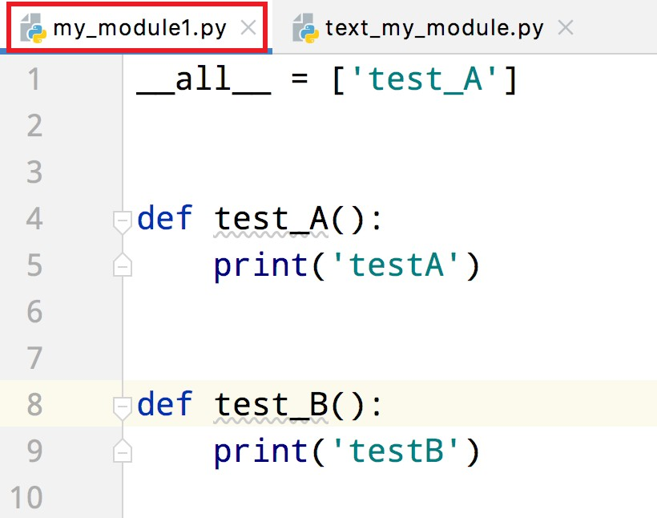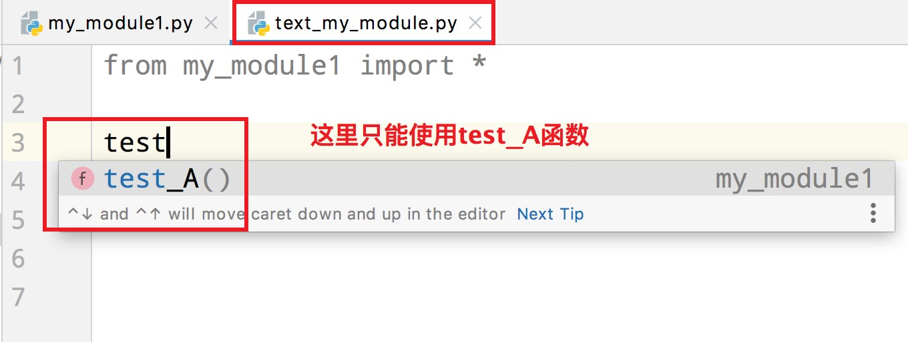

### 总结：

1.  如何自定义模块并导入？

在Python 代码文件中正常写代码即可，通过 import 、 from 关键字和导入Python 内置模块一样导入即可使用。

2. \__main__变量的功能是：

if \__main__ == " \_\_main__ " 表示，只有当程序是直接执行的才会进入 if 内部，如果是被导入的，则 if 无法进入

3. 注意事项

-   不同模块，同名的功能，如果都被导入，那么后导入的会覆盖先导入的

-   \__all__  变量可以控制 import \* 的时候哪些功能可以被导入

# 五、Python包

## 自定义包

基于 Python 模块，我们可以在编写代码的时候，导入许多外部代码来丰富功能。

但是，如果 Python 的模块太多了，就可能造成一定的混乱，那么如何管理呢？

> 通过Python 包的功能来管理。

### 什么是 Python 包

* 从物理上看，包就是一个文件夹，在该文件夹下包含了一个 init .py 文件，该文件夹可用于包含多个模块文件

* 从逻辑上看，包的本质依然是模块

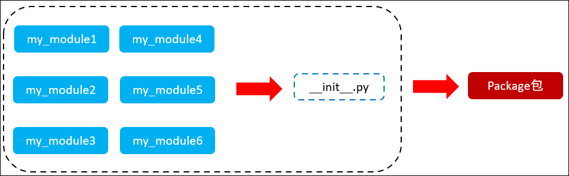

> **包的作用 :**
>
> 当我们的模块文件越来越多时 , 包可以帮助我们管理这些模块，包的作用就是包含多个模块，但包的本质依然是模块
> 

### 快速入门

步骤如下：

1. 新建包 my_package
2. 新建包内模块：my_module1 和 my_module2
3. 模块内代码如下：

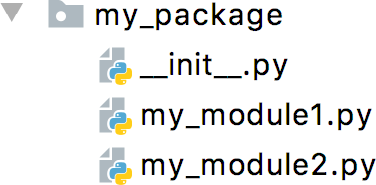

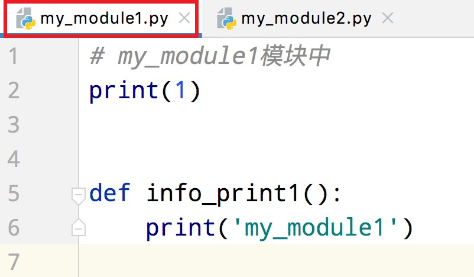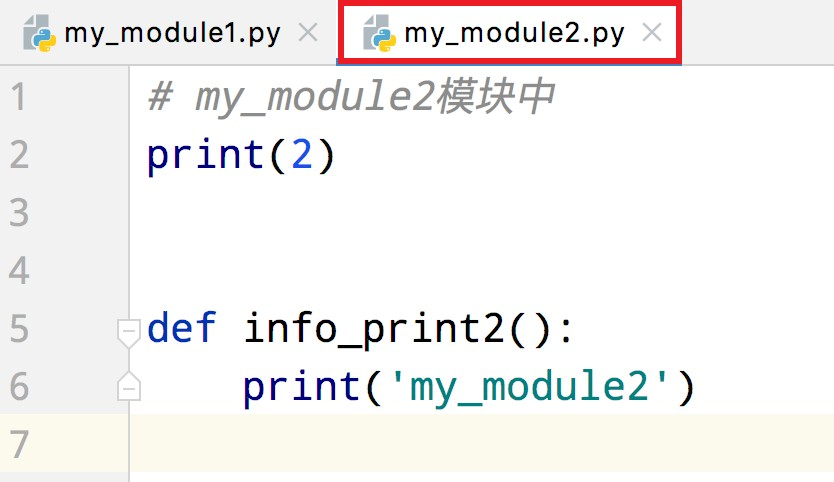

### 导入包

方式一：

```python
import 包名.模块名
包名.模块名.目标
```

示例代码：

```python
# 导入自定义的包中的模块
# import mypackage.my_module1
# import mypackage.my_module2
# mypackage.my_module1.info_print1()
# mypackage.my_module2.info_print2()

# from mypackage import my_module1
# from mypackage import my_module2
# my_module1.info_print1()
# my_module2.info_print2()

from  mypackage.my_module1 import info_print1
from  mypackage.my_module2 import info_print2
info_print1()
info_print2()
```

方式二：

```python
from 包名 import *
模块名.目标
```

> 注意：必须在 init .py 文件中添加 all = \[ ]，控制允许导入的模块列表

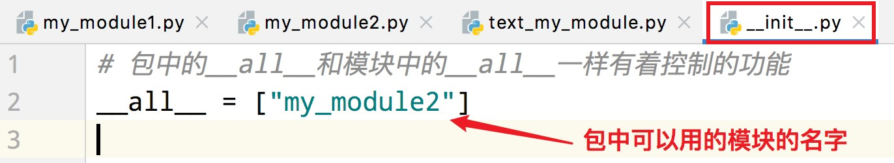


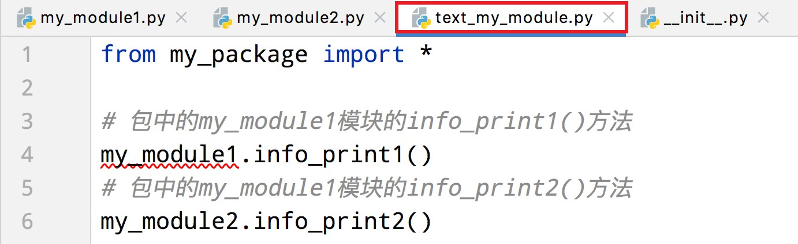my_module1 报红证明不可用

> **注意:**
>
> all 针对的是 from \... import \* 这种方式，对 import xxx 这种方式无效

### 总结

1.  什么是 Python 的包？

包就是一个文件夹，里面可以存放许多 Python 的模块（代码文件），通过包在逻辑上将一批模块归为一类，方便使用。

2.  init .py 文件的作用？

创建包会默认自动创建的文件，通过这个文件来表示一个文件夹是 Python 的包，而非普通的文件夹。

3.  all 变量的作用？

同模块中学习到的是一个作用，控制 import \* 能够导入的内容

## 安装第三方包

### 什么是第三方包

我们知道，包可以包含一堆的 Python 模块，而每个模块又内含许多的功能。所以，我们可以认为：一个包，就是一堆同类型功能的集合体。

在Python 程序的生态中，有许多非常多的第三方包（非 Python  官方），可以极大的帮助我们提高开发效率，如：

-   科学计算中常用的： numpy 包

-   数据分析中常用的： pandas 包

-   大数据计算中常用的： pyspark 、 apache-flink 包

-   图形可视化常用的： matplotlib 、 pyecharts

-   人工智能常用的： tensorflow

-   等

这些第三方的包，极大的丰富了 Python 的生态，提高了开发效率。

但是由于是第三方，所以 Python 没有内置，所以我们需要安装它们才可以导入使用。

### 安装第三方包 - pip

第三方包的安装非常简单，我们只需要使用 Python 内置的 pip 程序即可。

打开命令提示符程序，在里面输入：`pip install 包名称`，即可通过网络快速安装第三方包

### pip 的网络优化

由于pip 是连接的国外的网站进行包的下载，所以有的时候会速度很慢。

我们可以通过如下命令，让其连接国内的网站进行包的安装：

> pip install -i https://pypi.tuna.tsinghua.edu.cn/simple 包名称

https://pypi.tuna.tsinghua.edu.cn/simple 是清华大学提供的一个网站，可供 pip 程序下载第三方包

### 用PyCharm安装第三方包

PyCharm 也提供了安装第三方包的功能：

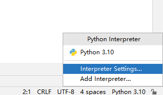


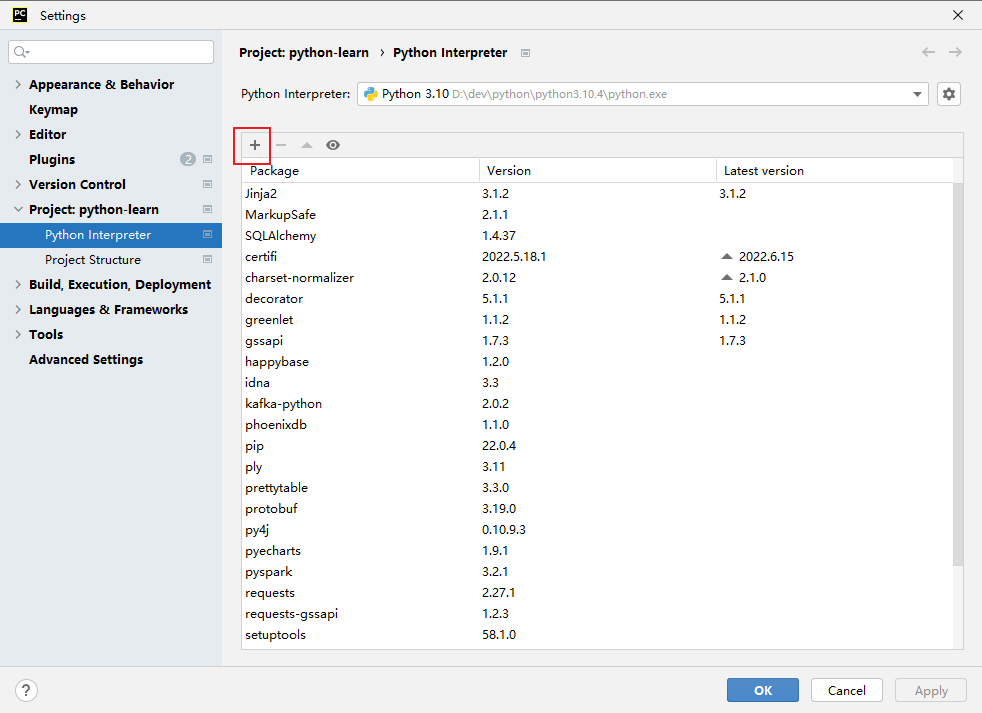{width="4.194407261592301in" height="3.045103893263342in"}


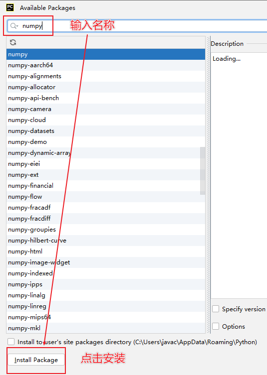{width="2.5708333333333333in" height="3.6194444444444445in"}

### 练习案例：自定义工具包

创建一个自定义包，名称为： my_utils ( 我的工具）

在包内提供 2 个模块：

- str_util.py （字符串相关工具，内含：）

  * 函数 str_reverse(s)：接受传入字符串，将字符串反转返回

  * 函数 substr(s,x,y)：按照下标 x 和 y ，对字符串进行切片

-   file_util.py （文件处理相关工具，内含：）
    -   函数 print_file_info(file_name)：接收传入文件的路径，打印文件的全部内容，如文件不存在则捕获异常，输出提示信息，通过 fill 关闭文件对象
    -   函数 append_to_file(file_name,data)：接收文件路径以及传入数据，将数据追加写入到文件中


构建出包后，尝试着用一用自己编写的工具包。

```python
# 字符串处理相关的工具模块

def str_reverse(s):
    """
    功能：将字符串完成反转操作
    :param s: 将被反转的字符串
    :return: 反转后的字符串
    """
    return s[::-1]

def substr(s,x,y):
    """
    功能：按照给定的下标完成给定字符串的切片
    :param s: 即将被切片的字符串
    :param x: 切片的开始下标
    :param y: 切片的结束下标
    :return: 切片完成后的字符串
    """
    return s[x:y]

if __name__=='__main__':
    print(str_reverse('黑马程序员'))
    print(substr('黑马程序员',1,3))
```


```python
# 文件处理相关的工具模块

def print_file_info(file_name):
    """
    功能：将给定路径的文件内容输出到控制台中
    :param file_name: 即将读取的文件路径
    :return: None
    """
    f=None
    try:
        f=open(file_name,"r",encoding="utf-8")
        content=f.read()
        print("文件的全部内容如下：")
        print(content)
    except Exception as e:
        print(f"程序出现异常了，原因是：{e}")
    finally:
        if f:
            f.close()

def append_to_file(file_name,data):
    """
    功能：将给定的数据追加到指定的文件中
    :param file_name: 指定的文件路径
    :param data: 指定的数据
    :return: None
    """
    f=open(file_name,"a",encoding="utf-8")
    f.write(data)
    f.write("\n")
    f.close()

if __name__=='__main__':
    print_file_info("D:/bill.txt")
    append_to_file("D:/teat_append.txt","黑马程序员")
```


```python
import my_utils.str_util
from my_utils import file_util

print(my_utils.str_util.str_reverse("黑马程序员"))
print(my_utils.str_util.substr("黑马程序员",0,4))

file_util.print_file_info("D:test_append.txt")
file_util.append_to_file("D:test_append.txt","itheima")
```

