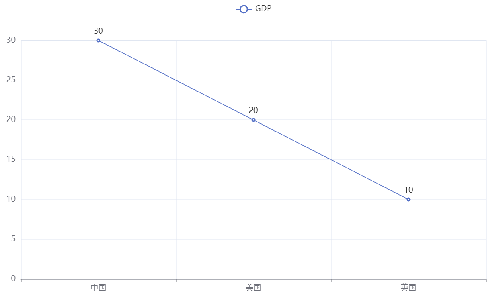

效果一： 2020 年印美日新冠累计确诊人数

2020 年是新冠疫情爆发的一年 , 随着疫情的爆发，国内外确诊人数成了大家关心的热点，相信大家都有看过类似的疫情报告。本案例对印度美国日本三个国家确诊人数的进行了可视化处理，形成了可视化的疫情确诊人数报告。


效果二：全国疫情地图可视化


效果三：动态 GDP 增长图


数据来源：

-   本案例数据全部来自 \<\< 百度疫情实时大数据报告 \>\>，及公开的全球各国 GDP 数据

使用的技术：

**Echarts**是一个由百度开源的数据可视化，凭借着良好的交互性，精巧的图表设计，得到了众多开发者的认可。而 **Python** 是门富有表达力的语言，很适合用于数据处理。当数据分析遇上数据可视化时，pyecharts 诞生了。


# 一、json数据格式

## 什么是 json

-   JSON 是一种轻量级的数据交互格式。可以按照 JSON 指定的格式去组织和封装数据
    
-   JSON 本质上是一个带有特定格式的字符串

- **主要功能**： json 就是一种在各个编程语言中流通的数据格式，负责不同编程语言中的数据传递和交互。类似于：

  -   国际通用语言 - 英语


  -   中国 56 个民族不同地区的通用语言 - 普通话


## json 有什么用

各种编程语言存储数据的容器不尽相同，在Python 中有字典 dict 这样的数据类型，而其它语言可能没有对应的字典。

为了让不同的语言都能够相互通用的互相传递数据，JSON 就是一种非常良好的中转数据格式。如下图，以 Python 和 C 语言互传数据为例：


## json 格式数据转化

json 格式的数据要求很严格 , 下面我们看一下他的要求：

```json
# json 数据的格式可以是：
{"name":"admin","age":18} 

# 也可以是： 
[{"name":"admin","age":18},{"name":"root","age":16},{"name":" 张三 ","age":20}]
```

## Python 数据和 Json 数据的相互转化

```python
# 导入 json 模块
import json 

# 准备符合格式 json 格式要求的 python 数据
data = [{"name": " 老王 ", "age": 16}, {"name": " 张三 ", "age": 20}]

# 通过 json.dumps(data) 方法把 python 数据转化为了 json 数据
data = json.dumps(data) 

# 通过 json.loads(data) 方法把 json 数据转化为了 python 数据
data = json.loads(data)
```

示例代码：

```python
import json

# 将嵌套字典的列表转换为json
data=[{"name":"张大山","age":11},{"name":"王大锤","age":13},{"name":"赵小虎","age":16}]
# json_str=json.dumps(data)
json_str=json.dumps(data,ensure_ascii=False)
print(type(json_str))
print(json_str)

# 将字典转换为json
d={"name":"周杰伦","addr":"台北"}
json_str=json.dumps(d,ensure_ascii=False)
print(type(json_str))
print(json_str)

# 将json字符串转换回列表
s='[{"name": "张大山", "age": 11}, {"name": "王大锤", "age": 13}, {"name": "赵小虎", "age": 16}]'
l=json.loads(s)
print(type(l))
print(l)

# 将json转换回字典
s='{"name":"周杰伦","addr":"台北"}'
d=json.loads(s)
print(type(d))
print(d)
```

## 总结

1.  **json** ：是一种轻量级的数据交互格式，采用完全独立于编程语言的文本格式来存储和表示数据（就是字符串)

Python 语言使用 JSON 有很大优势，因为： JSON 无非就是一个单独的字典或一个内部元素都是字典的列表，所以 JSON 可以直接和 Python 的字典或列表进行无缝转换。

2. json格式数据转换

* 通过 `json.dumps(data)`方法把 python数据转化为了 json数据
  * 如果有中文可以带上： ensure_ascii=False 参数来确保中文正常转换

* 通过 json.loads(data)方法把 josn数据转化为了 python列表

# 二、pyecharts模块介绍

## pyecharts 模块

开发可视化图表使用的技术栈是：Echarts 框架的Python 版本——PyEcharts 包

如果想要做出数据可视化效果图 , 可以借助 pyecharts 模块来完成

**概况** :

**Echarts**是一个由百度开源的数据可视化，凭借着良好的交互性，精巧的图表设计，得到了众多开发者的认可。而 **Python** 是门富有表达力的语言，很适合用于数据处理。当数据分析遇上数据可视化时 pyecharts 诞生了。

要查看官方示例，可打开官方画廊： https://gallery.pyecharts.org/#/README

## pyecharts 模块安装

使用在前面学过的 pip 命令即可快速安装 PyEcharts 模块

-   `pip install pyecharts`

{width="7.8in" height="3.9in"}

# 三、pyecharts快速入门

## pyechars 入门

-   **基础折线图**

```python
# 导包，导入Line功能构建折线图对象
from pyecharts.charts import Line

# 得到折线图对象
line=Line()

# 添加x轴数据
line.add_xaxis(["中国","美国","英国"])

# 添加y轴数据
line.add_yaxis("GDP",[30,20,10])

# 生成图表
# 通过render方法，将代码生成为图像
line.render()
```

{width="6.0213090551181105in"
height="3.683333333333333in"}

## pyecharts 的配置选项

pyecharts 模块中有很多的配置选项 , 常用到 2 个类别的选项：

-   全局配置选项

-   系列配置选项

**全局配置选项**可以通过`set_global_opts`方法来进行配置 , 相应的选项和选项的功能有 :

* 配置图表的标题

-   配置图例

-   配置鼠标移动效果

-   配置工具栏

-   等整体配置项

{width="7.926388888888889in"height="4.666666666666667in"}

系列配置项，我们在后面构建案例时讲解

## set_global_opts 方法

```python
from pyecharts.options import TitleOpts,LegendOpts,ToolboxOpts,VisualMapOpts

# 设置全局配置项
line.set_global_opts(
    title_opts=TitleOpts(title="GDP展示",pos_left="center",pos_bottom="1%"),
    legend_opts=LegendOpts(is_show=True),
    toolbox_opts=ToolboxOpts(is_show=True),
    visualmap_opts=VisualMapOpts(is_show=True)
)
```

效果展示：


# 四、数据处理

-   原始数据格式：


-   导入模块：


```python
# 导入json模块
import json
```

-   对数据进行整理 , 让数据符合 json 格式：

```python
# 处理数据
f_us=open("10-数据可视化-折线图/美国.txt","r",encoding="utf-8")
us_data=f_us.read()

f_jp=open("10-数据可视化-折线图/日本.txt","r",encoding="utf-8")
jp_data=f_jp.read()

f_in=open("10-数据可视化-折线图/印度.txt","r",encoding="utf-8")
in_data=f_in.read()

# 去掉不合json规范的开头
us_data=us_data.replace("jsonp_1629344292311_69436(","")
jp_data=jp_data.replace("jsonp_1629350871167_29498(","")
in_data=in_data.replace("jsonp_1629350745930_63180(","")

# 去掉不合json规范的结尾
us_data=us_data[:-2]
jp_data=jp_data[:-2]
in_data=in_data[:-2]

# json转python字典
us_dict=json.loads(us_data)
jp_dict=json.loads(jp_data)
in_dict=json.loads(in_data)

# 获取trend key
us_trend_data=us_dict['data'][0]['trend']
jp_trend_data=jp_dict['data'][0]['trend']
in_trend_data=in_dict['data'][0]['trend']

# 获取日期数据，用于x轴，取2020年（到314下标结束）
us_x_data=us_trend_data['updateDate'][:314]
jp_x_data=jp_trend_data['updateDate'][:314]
in_x_data=in_trend_data['updateDate'][:314]

# 获取确认数据，用于y轴，取2020年（到314下标结束）
us_y_data=us_trend_data['list'][0]['data'][:314]
jp_y_data=jp_trend_data['list'][0]['data'][:314]
in_y_data=in_trend_data['list'][0]['data'][:314]
```

# 五、创建折线图

* **导入模块**

```python
# 导入折线图模块
from pyecharts.charts import Line
# 导入配置选项模块
from pyecharts.options import TitleOpts,LabelOpts,LegendOpts,ToolboxOpts,VisualMapOpts
```

-   **折线图相关配置项**


| 配置项     | 作用                   | 代码实例                                                   |
| ---------- | ---------------------- | ---------------------------------------------------------- |
| init_opts  | 对折线图初始化设置宽高 | init_opts=opts.InitOpts(width=\"1600px\",height=\"800px\") |
| .add_xaxis | 添加 x 轴数据          | .add_xaxis( 列表)                                          |
| .add_yaxis | 添加 y 轴数据          |                                                            |

-   **创建折线图**

```python
line=Line()
```

-   **添加数据**

```python
line.add_xaxis(us_x_data)# x轴是共用的，所以使用一个国家的数据即可
line.add_yaxis("美国确诊人数",us_y_data,label_opts=LabelOpts(is_show=False))
line.add_yaxis("日本确诊人数",jp_y_data,label_opts=LabelOpts(is_show=False))
line.add_yaxis("印度确诊人数",in_y_data,label_opts=LabelOpts(is_show=False))
```

-   **.add_yaxis 相关配置选项**


| 配置项         | 作用                   | 代码实例                                   |
| -------------- | ---------------------- | ------------------------------------------ |
| series_name    | 设置图例名称           | series_name=\"美国确诊人数 "               |
| y_axis         | 输入y 轴数据           | y_axis=\[\" 列表"]                         |
| symbol_size    | 设置点的大小           | symbol_size=10                             |
| label_opts     | 标签设置项：不显示标签 | label_opts=opts.LabelOpts(is_show=False)   |
| linestyle_opts | 线条宽度和样式         | linestyle_opts=opts.LineStyleOpts(width=2) |


-   **.set_global_opts 全局配置选项 :**


| 配置项      | 作用             | 代码实例                                                     |
| ----------- | ---------------- | ------------------------------------------------------------ |
| title_opts  | 设置图标题和位置 | title_opts=opts.TitleOpts(title=\"标题 \",pos_left=\"center\") |
| yaxis_opts  | y 轴配置项       | yaxis_opts=opts.AxisOpts(name=\"累计确诊人数 \")             |
| xaxis_opts  | x 轴配置项       | xaxis_opts=opts.AxisOpts(name=\"时间 \"                      |
| legend_opts | 图例配置项       | legend_opts=opts.LegendOpts(pos_left=\'> 70%\')              |

```python
# 设置全局配置项
line.set_global_opts(
    title_opts=TitleOpts(title="2020年美日印三国确诊人数对比图",pos_left="center",pos_bottom="1%"),
    #legend_opts=LegendOpts(is_show=True),
    toolbox_opts=ToolboxOpts(is_show=True),
    #visualmap_opts=VisualMapOpts(is_show=True)
)

line.render()

# 关闭文件对象
f_us.close()
f_jp.close()
f_in.close()
```

效果展示：


